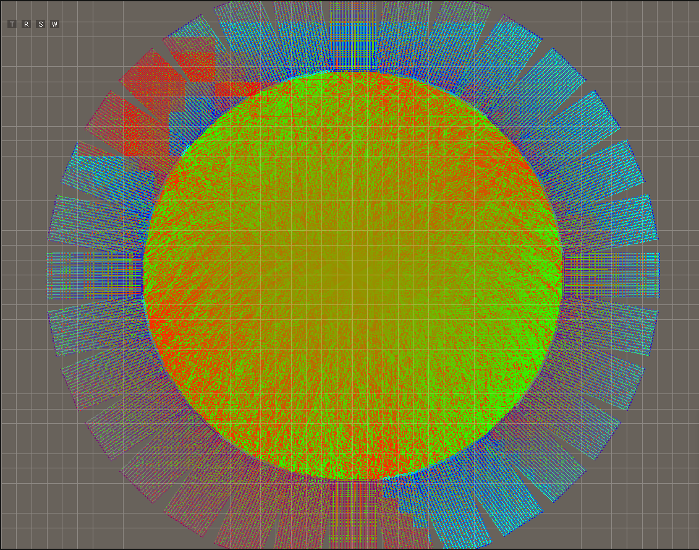

# TazGraph (40.9 MB)

TazGraph is a real-time, extensible 3D graph visualization and editing tool powered by a custom Entity-Component System (GECS) and OpenGL rendering.

## Getting Started
create a build folder in root
necessary programs: cmake, g++
WSL: 
`sudo apt-get install libsdl2-dev libsdl2-image-dev libsdl2-ttf-dev libsdl2-mixer-dev libglew-dev libglm-dev libopengl`
if libopengl does not exist:
`sudo apt install freeglut3-dev mesa-common-dev`

Start by cloning the repository with
`git clone --recursive https://carvgit.ics.forth.gr/kotsonas/tazgraph`

If the repository was cloned non-recursively previously, use `git submodule update --init` to clone the necessary submodules.

In build/:
\
`cmake -DCMAKE_BUILD_TYPE=Release ..`
\
`make`

in TazGraph/TazGraph/:
`../build/TazGraph/TazGraph`

For Windows:
In root folder:
`msbuild TazGraph.sln /p:Configuration=Release /p:Platform=x64`

In TazGraph/:
`../x64/Debug/TazGraph.exe`

## Intro

TazGraph was developed as part of a master's thesis to provide a performant and modular framework for interactive graph editing and exploration. It supports scene management, multithreaded rendering, and real-time updates, tailored for visual analysis, research, and rapid prototyping of graph algorithms.

Entities are grouped into custom groups (nodes, links, empty), and rendering is decoupled from logic using optimized renderer classes. Developers can extend the engine through custom loaders, renderers, and graph behaviors.

The architecture draws inspiration from game engines, using ECS for flexibility and batching techniques for performance.

## Developer Guide: [DoxyDevGuide](https://mujingr.github.io/TazGraph/html/dev_guide.html)

Full Documentation:
[DoxyDocument](https://mujingr.github.io/TazGraph/html/index.html)
\
Or download the pdf documentation: [PDF Documentation](docs/latex/refman.pdf)

