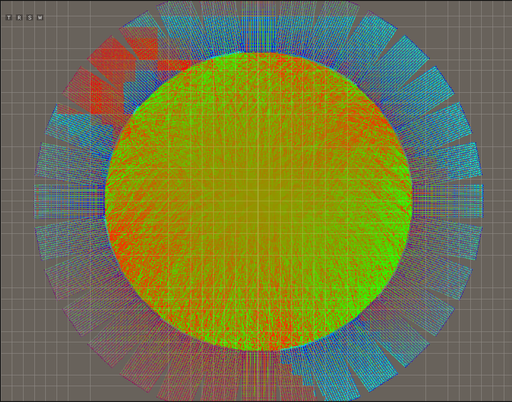
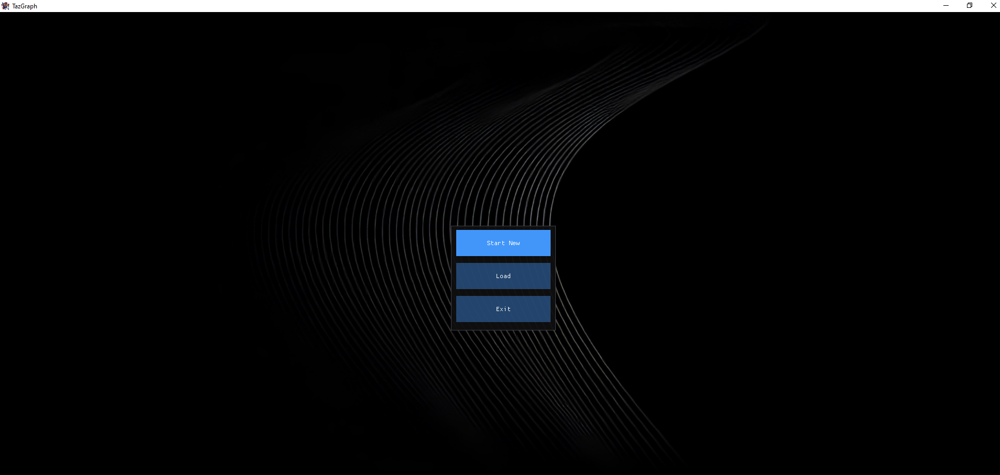
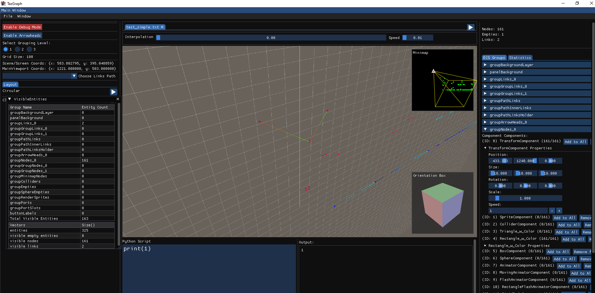
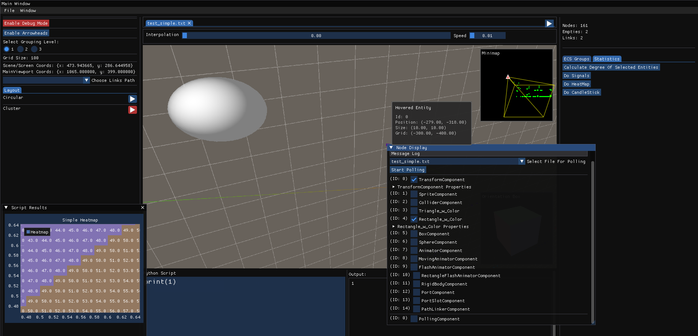

# TazGraph (40.9 MB)

TazGraph is a modular, high-performance 3D graph editor built in C++ with OpenGL, designed for efficient visualization and interaction with large-scale graph data.

## Getting Started
create a build folder in root
necessary programs: cmake, g++
Ubuntu: 
`sudo apt-get install libsdl2-dev libsdl2-image-dev libsdl2-ttf-dev libsdl2-mixer-dev libglew-dev libglm-dev libopengl`

`sudo apt install python3-dev libpython3-dev python3.12-dev libjs-sphinxdoc`

if libopengl does not exist:
`sudo apt install freeglut3-dev mesa-common-dev`

><b>Windows (Visual Studio 2022)</b>  
The project was primarily tested on Visual Studio 2022.  
>- Build settings are defined in the .vcxproj file. 
>- Some large libraries (e.g., SDL, GLEW, Python) are not included locally in the repository.  
Instead, only their DLLs are committed. From these DLLs you can check which versions were used,  
but you may also use your own versions. 
>- Library paths can be configured either through Project Properties in Visual Studio or  
directly by editing the .vcxproj file to point to the locations of the libraries on your system. 
(e.g. `$(SolutionDir)deps/lib;C:\Users\lefte\AppData\Local\Programs\Python\Python313\libs;`, `$(SolutionDir)deps\include;C:\Users\lefte\AppData\Local\Programs\Python\Python313\include`)

Start by cloning the repository with  
\
Github: 
`git clone --recursive https://github.com/mujinGr/TazGraph.git`
\
GitLab: 
`git clone --recursive https://carvgit.ics.forth.gr/kotsonas/tazgraph.git`

If the repository was cloned non-recursively previously, use `git submodule update --init` to clone the necessary submodules.

### Build 
`mkdir build`
\
`cd build`
\
`cmake -DCMAKE_BUILD_TYPE=Release ..`
\
`make`

in TazGraph/TazGraph/:
`../build/TazGraph/TazGraph `**`N`**
where N is the number of threads to use

**For Windows**:\
In root folder:
`msbuild TazGraph.sln /p:Configuration=Release /p:Platform=x64`

In TazGraph/:
`../x64/Release/TazGraph.exe `**`N`**
where N is the number of threads to use

**Arguments**:\

- `--num-threads=X` # number of worker threads (int)
- `--MSAA=V` # multisample anti-aliasing level (int, e.g. 0, 2, 4, 8)
- `--open-file=Y` # path to file opened on startup (string)
- `--initial-timestamp=Z` # initial time value when starting playback/simulation (float or int)
- `--initial-step=W` # initial simulation step/frame index (int)
- `--use-python=C` # enable Python scripting (0 = off, 1 = on)
- `--bg-color=FR,FG,FB,FA` # background color as RGBA floats in range [0,1]
- `--grid=G` # grid mode or grid size (int or enum)

## Intro

Originally developed to support HPC simulation workflows,  
TazGraph enables real-time rendering of over 10,000 nodes and 60,000 links on consumer-grade hardware. 
It provides a flexible and extensible interface for visualizing complex systems using intuitive node-link diagrams. 
 
TazGraph is powered by a custom Entity-Component System (ECS) inspired by game engines.  
Entities (nodes, links, or empty) are modular, scriptable, and dynamically composed at runtime.  
The system supports multi-threaded batching, instanced rendering, and a 3D interactive workspace with support for multiple graphs and statistical overlays. 
 
Unlike many existing graph tools that are either limited in scope or hard to extend, 
TazGraph offers a lightweight, cross-platform platform ideal for rapid prototyping, HPC monitoring, and deep structural analysis.

#### Built with:
- C++ & OpenGL
- ImGui & ImPlot
- Multithreaded ECS
- Custom renderer batching pipeline

Built with performance and flexibility in mind, TazGraph integrates 
real-time rendering, multithreading, and intuitive editing features 
into a unified environment.

#### Features:
- 3D World  
- Custom Renderers  
- Multithreading  
- Path Links Integration  
- Multiple Editor  Tabs  
- 3D Models with Lighting  
- Simulation Play  

 

## Developer Guide: [DoxyDevGuide](https://mujingr.github.io/TazGraph/html/dev_guide.html)

Full Documentation:
[DoxyDocument](https://mujingr.github.io/TazGraph/html/index.html)
\
Or download the pdf documentation: [PDF Documentation](https://github.com/mujinGr/TazGraph/blob/docs/docs/latex/refman.pdf)

